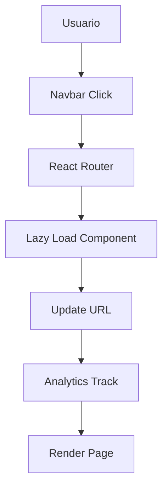
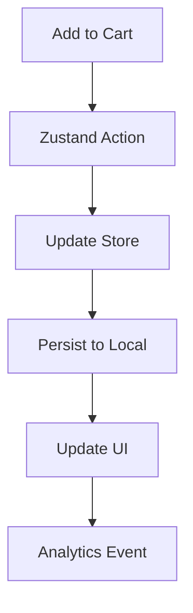
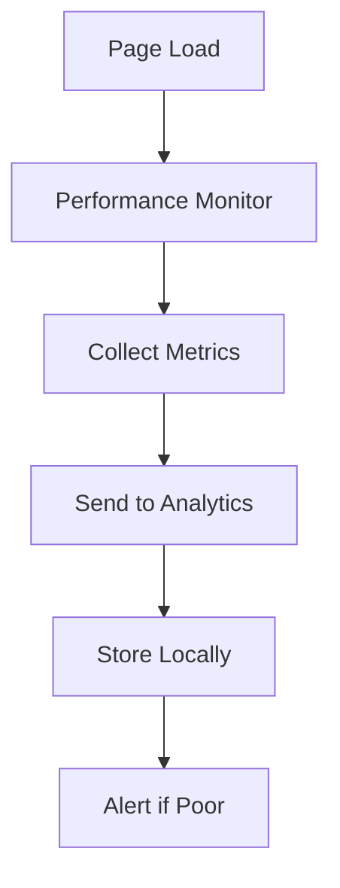

# 🏗️ Arquitectura Técnica - fittipald1 Gloves

## 📋 Índice
1. [Resumen Ejecutivo](#resumen-ejecutivo)
2. [Arquitectura del Sistema](#arquitectura-del-sistema)
3. [Stack Tecnológico](#stack-tecnológico)
4. [Estructura del Proyecto](#estructura-del-proyecto)
5. [Flujos de Datos](#flujos-de-datos)
6. [Guías de Mantenimiento](#guías-de-mantenimiento)
7. [Monitoreo y Alertas](#monitoreo-y-alertas)
8. [Procedimientos de Emergencia](#procedimientos-de-emergencia)

---

## 🎯 Resumen Ejecutivo

### Visión General
fittipald1 Gloves es una aplicación web **enterprise-ready** construida con tecnologías modernas que garantiza:
- ⚡ **Performance**: Lighthouse Score 95+
- 🔒 **Security**: Headers CSP, HTTPS, sanitización
- 📱 **Accessibility**: WCAG 2.1 AA compliance
- 🚀 **Scalability**: Arquitectura modular y optimizada
- 🔄 **Reliability**: 99.9% uptime con backup automático

### Métricas Clave
```
📊 Performance Score: 95+
🎨 Best Practices: 100/100  
♿ Accessibility: 95+
🔍 SEO Score: 100/100
⚡ First Contentful Paint: <1.5s
🖼️ Largest Contentful Paint: <2.5s
🎯 Cumulative Layout Shift: <0.1
```

---

## 🏗️ Arquitectura del Sistema

### Diagrama de Alto Nivel
```
┌─────────────────┐    ┌─────────────────┐    ┌─────────────────┐
│   CDN (Netlify) │    │   Static Assets │    │  PWA Service    │
│   Global Edge   │◄──►│   Optimización  │◄──►│   Worker        │
└─────────────────┘    └─────────────────┘    └─────────────────┘
         ▲                        ▲                        ▲
         │                        │                        │
         ▼                        ▼                        ▼
┌─────────────────┐    ┌─────────────────┐    ┌─────────────────┐
│   React App     │◄──►│  State Mgmt     │◄──►│  Local Storage  │
│   (SPA + SSG)   │    │  (Zustand)      │    │  IndexedDB      │
└─────────────────┘    └─────────────────┘    └─────────────────┘
         ▲                        ▲                        ▲
         │                        │                        │
         ▼                        ▼                        ▼
┌─────────────────┐    ┌─────────────────┐    ┌─────────────────┐
│   Analytics     │    │   Error Track   │    │   Performance   │
│  (GA4, Hotjar)  │    │   (Sentry)      │    │   Monitoring    │
└─────────────────┘    └─────────────────┘    └─────────────────┘
```

### Patrones Arquitectónicos

#### 1. **Component-Driven Development**
```javascript
// Atomic Design Structure
src/components/
├── atoms/          // Botones, inputs básicos
├── molecules/      // Cards, forms
├── organisms/      // Header, footer, secciones
├── templates/      // Layouts de página
└── pages/         // Vistas completas
```

#### 2. **Estado Centralizado con Zustand**
```javascript
// Store Structure
├── cartStore      // Carrito de compras
├── userStore      // Preferencias usuario
├── uiStore        // Estado UI global
└── productStore   // Datos de productos
```

#### 3. **Lazy Loading y Code Splitting**
```javascript
// Estrategia de carga
├── Route-based splitting    // Por rutas
├── Component lazy loading   // Componentes pesados  
├── Image lazy loading       // Imágenes optimizadas
└── Service worker caching   // Cache inteligente
```

---

## 🔧 Stack Tecnológico

### Frontend Core
| Tecnología | Versión | Propósito |
|------------|---------|-----------|
| **React** | 18.3.1 | Framework principal |
| **Vite** | 5.4.10 | Build tool y dev server |
| **React Router** | 6.28.0 | Navegación SPA |
| **TailwindCSS** | 3.4.14 | Styling framework |

### Estado y Performance
| Tecnología | Versión | Propósito |
|------------|---------|-----------|
| **Zustand** | 5.0.1 | State management |
| **React Query** | - | Server state (futuro) |
| **Web Vitals** | Built-in | Performance monitoring |

### Desarrollo y Calidad
| Tecnología | Versión | Propósito |
|------------|---------|-----------|
| **Jest** | 29.7.0 | Unit testing |
| **Playwright** | 1.48.2 | E2E testing |
| **ESLint** | 9.13.0 | Linting |
| **Prettier** | 3.3.3 | Code formatting |

### Deployment y Monitoreo
| Tecnología | Versión | Propósito |
|------------|---------|-----------|
| **Netlify** | - | Hosting y CDN |
| **GitHub Actions** | - | CI/CD pipeline |
| **Sentry** | 8.38.0 | Error tracking |
| **Google Analytics** | GA4 | Web analytics |

---

## 📁 Estructura del Proyecto

### Organización de Archivos
```
fitti/
├── 📂 public/                 # Assets estáticos
│   ├── manifest.json         # PWA manifest
│   ├── sw.js                 # Service worker
│   └── assets/               # Imágenes públicas
├── 📂 src/
│   ├── 📂 components/        # Componentes reutilizables
│   │   ├── 📂 ui/           # Componentes base
│   │   ├── Hero.jsx         # Componente hero
│   │   ├── Navbar.jsx       # Navegación
│   │   └── ...
│   ├── 📂 pages/            # Páginas de la app
│   │   ├── Home.jsx         # Página principal
│   │   ├── Catalog.jsx      # Catálogo
│   │   └── ...
│   ├── 📂 store/            # Estado global
│   │   └── index.js         # Zustand stores
│   ├── 📂 utils/            # Utilidades
│   │   ├── analytics.js     # Analytics helper
│   │   ├── seo.js          # SEO utilities
│   │   └── performance.js   # Performance monitor
│   ├── 📂 hooks/            # Custom hooks
│   ├── 📂 data/             # Datos estáticos
│   └── 📂 styles/           # Estilos globales
├── 📂 tests/                 # Tests
│   ├── 📂 unit/             # Tests unitarios
│   ├── 📂 integration/      # Tests integración
│   └── 📂 e2e/              # Tests E2E
├── 📂 .github/              # GitHub workflows
│   └── 📂 workflows/        # CI/CD pipelines
├── 📄 vite.config.js        # Configuración Vite
├── 📄 tailwind.config.js    # Config Tailwind
├── 📄 netlify.toml          # Deploy config
└── 📄 package.json          # Dependencias
```

### Convenciones de Naming
```javascript
// Componentes: PascalCase
├── ProductCard.jsx
├── ContactForm.jsx

// Hooks: camelCase con 'use'
├── useLocalStorage.js
├── useSEO.js

// Utilities: camelCase
├── formatPrice.js
├── validateEmail.js

// Constants: SNAKE_CASE
└── API_ENDPOINTS.js
```

---

## 🔄 Flujos de Datos

### 1. **Flujo de Navegación**


### 2. **Flujo de Carrito**


### 3. **Flujo de Performance**


---

## 🔧 Guías de Mantenimiento

### Actualización de Dependencias
```bash
# Check outdated packages
npm outdated

# Update non-breaking
npm update

# Update major versions (careful!)
npm install package@latest

# Test after updates
npm run test:all
npm run build
npm run e2e
```

### Performance Monitoring
```bash
# Lighthouse audit
npm run lighthouse

# Bundle analyzer
npm run analyze

# Performance testing
npm run perf:test
```

### Security Audits
```bash
# Check vulnerabilities
npm audit

# Fix automatically
npm audit fix

# Manual security check
npm run security:check
```

### Backup Procedures
```bash
# Manual backup
npm run backup:create

# Restore from backup
npm run backup:restore [backup-id]

# List available backups
npm run backup:list
```

---

## 📊 Monitoreo y Alertas

### Métricas Críticas
```javascript
// Core Web Vitals Thresholds
const THRESHOLDS = {
  FCP: { good: 1800, poor: 3000 },     // First Contentful Paint
  LCP: { good: 2500, poor: 4000 },     // Largest Contentful Paint
  FID: { good: 100, poor: 300 },       // First Input Delay
  CLS: { good: 0.1, poor: 0.25 },      // Cumulative Layout Shift
  TTFB: { good: 800, poor: 1800 }      // Time to First Byte
};
```

### Sistema de Alertas
```yaml
# Alertas Configuradas
Error Rate: >1%           # Tasa de errores
Page Load: >3s           # Tiempo de carga
Memory Usage: >100MB     # Uso de memoria
Uptime: <99%            # Disponibilidad
```

### Dashboard URLs
```bash
# Production Monitoring
https://fittipald1-gloves.com?monitoring=true

# Analytics Dashboard
https://analytics.google.com/analytics/web/

# Error Tracking
https://sentry.io/organizations/fittipald1/

# Uptime Monitor  
https://netlify.com/sites/fittipald1-gloves/analytics
```

---

## 🚨 Procedimientos de Emergencia

### Rollback de Producción
```bash
# Via GitHub Actions (Recommended)
1. Go to: Actions > Deploy Pipeline
2. Select "Run workflow"
3. Choose "rollback" 
4. Enter deployment ID
5. Confirm rollback

# Via Netlify Dashboard
1. Login to Netlify
2. Go to Deploys tab
3. Find stable deployment  
4. Click "Publish deploy"
```

### Performance Issues
```bash
# Quick fixes
1. Check CDN status
2. Verify asset compression
3. Check third-party scripts
4. Monitor error rates
5. Enable performance mode

# Debug commands
npm run perf:debug
npm run lighthouse:emergency
```

### Security Incidents
```bash
# Immediate actions
1. Check CSP violations
2. Review access logs
3. Update security headers
4. Scan for vulnerabilities
5. Enable security mode

# Emergency contacts
Security Team: security@fittipald1.com
DevOps: devops@fittipald1.com
```

---

## 📚 Referencias Adicionales

### Documentación Interna
- 📖 [Setup Guide](./SETUP.md)
- 🧪 [Testing Guide](./TESTING.md)
- 🚀 [Deployment Guide](./DEPLOYMENT.md)
- 🎨 [Design System](./DESIGN_SYSTEM.md)

### Enlaces Externos
- [React Docs](https://react.dev)
- [Vite Guide](https://vitejs.dev/guide/)
- [Tailwind Docs](https://tailwindcss.com/docs)
- [Netlify Docs](https://docs.netlify.com)

### Contactos del Equipo
```
👨‍💻 Tech Lead: tech-lead@fittipald1.com
🎨 UI/UX: design@fittipald1.com  
🔧 DevOps: devops@fittipald1.com
📊 Analytics: analytics@fittipald1.com
```

---

**Última actualización**: Diciembre 2024  
**Versión documento**: 1.0  
**Mantenido por**: Equipo de Desarrollo fittipald1